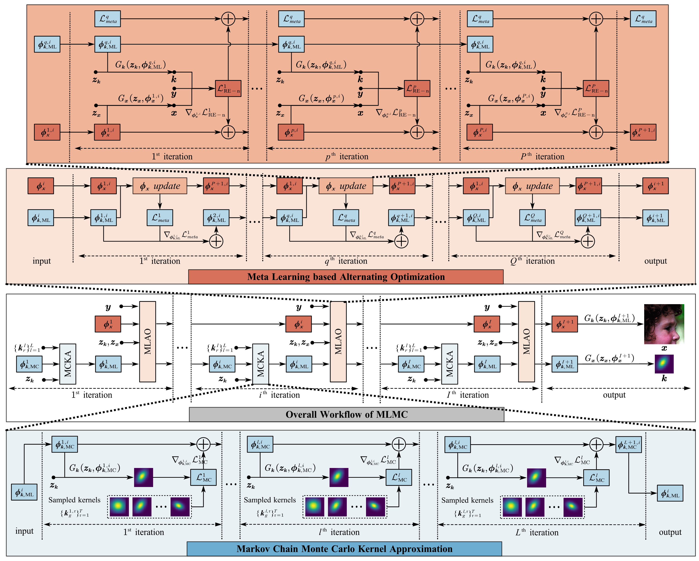

# Blind Super-Resolution via Meta-learning and Markov Chain Monte Carlo Simulation (MLMC)

This repository is the official PyTorch implementation of MLMC to Blind Super-Resolution 

 ---

> Learning based approaches have witnessed great successes in blind single image super-resolution (SISR) tasks, however, handcrafted kernel priors  and learning based kernel priors are typically required. In this paper, we propose a Meta-learning and Markov Chain  Monte Carlo based SISR approach to learn kernel priors from organized randomness.
In concrete, a lightweight network is adopted as kernel generator, and is optimized via learning from the MCMC simulation on random Gaussian distributions. This procedure provides an approximation for the rational blur kernel, and introduces a network-level Langevin dynamics into SISR optimization processes, which contributes to preventing bad local optimal solutions for kernel estimation.
Meanwhile, a meta-learning based alternating optimization procedure is proposed to optimize the kernel generator and image restorer, respectively. 
In contrast to the conventional alternating minimization strategy, a meta-learning based framework is applied to learn an adaptive optimization strategy, which is less-greedy and results in better convergence performance. These two procedures are iteratively processed in a plug-and-play fashion, for the first time, realizing a learning-based but plug-and-play blind SISR solution in unsupervised inference. 
Extensive simulations demonstrate the superior performance and generalization ability of the proposed approach when comparing with state-of-the-arts on synthesis and real-world datasets. 
><p align="center">
  > 
</p>

## Requirements
- pip install -r requirements.txt 

## Run MLMC
To run the code without preparing data, run this command:
```bash
cd MLMC
python main.py
```

---

## Run MLMC-USRNet
To run the code without preparing data, run this command:
```bash
cd MLMC-USRNet
python main.py
```
---


## Data Preparation 
To prepare testing data, please organize images as `data/datasets/Set5/HR/baby.png`, and run this command:
```bash
cd data
python prepare_dataset.py --model MLMC --sf 2 --dataset Set5
```


Commonly used datasets can be downloaded [here](https://github.com/xinntao/BasicSR/blob/master/docs/DatasetPreparation.md#common-image-sr-datasets).


## Acknowledgement

This project is released under the Apache 2.0 license. The codes are based on [FKP](https://github.com/JingyunLiang/FKP) and [BSRDM](https://github.com/zsyOAOA/BSRDM). Please also follow their licenses. Thanks for their great works.


